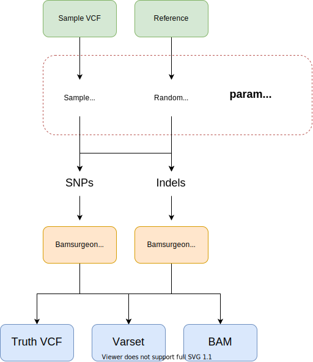

# variant-simulations-nf

## Overview



This nextflow pipeline generates a set of bams using bamsurgeon from which variant evaluation can take place. It allows examination of completely simulated variants and sampled variants for both SNPs and Indels.

The following steps are performed.

1. __real__ variants are samples from a given VCF (`params.vcf_file`) are sampled (Both SNP and INDEL).
2. __simulated__ simulated variants are generated from a FASTA (Both SNP and INDEL).
3. __resample__ - To create joint variants (variants shared among multiple samples), variants within the `real` and `simulated` sets are combined, shuffled, sampled from the top to replace a random number of variants in each variant dataset. Sampling from the top ensures some randomly selected variants will be shared among many samples.
4. __bamsurgeon__ - spikein is run using `addsnv.py` and `addindel.py`.
5. __cleanup__ - summary varset and truth set files are generated for downstream analysis.

## Output

The output directory `${params.output}` looks like this:

```
output/
├── bam
│   ├── <varset>_<snps|indels>_<real|simulated>.bam
│   └── <varset>_<snps|indels>_<real|simulated>.bam.bai
├── truth - Truth VCF Files
│   ├── <varset>_<snps|indels>_<real|simulated>.truth.vcf.gz
│   └── <varset>_<snps|indels>_<real|simulated>.truth.vcf.gz.csi
├── truth_summary.tsv
├── varset_summary.tsv
└── varsets
    ├── <varset>_<snps|indels>_<real|simulated>.tsv
    └── vcf
        └── <varset>_<snps|indels>.vcf.gz
```

`truth_summary.tsv` - Summarizes the spiked in variants.
`varset_summary.tsv` - Summarizes the variant sets. Not all variants are successfully spiked in.

## Configuration

The following options can be configured:

* `params.vcf_file` - a VCF file from which to sample real variants.
* `params.bam_file` - a BAM file to spike variants into.
* `params.n_variants` - The number of variants to spike in for each varset.

## hap.py comparison

```
docker run -it -v "${HOME}/.genome":/.genome \
               -v "${PWD}:${PWD}" \
               -w ${PWD} pkrusche/hap.py /opt/hap.py/bin/hap.py \
               1_indels_real.truth.vcf.gz \
               1_indels_real.exp.vcf -o 1_indels_real_eval -r  /.genome/WS276/c_elegans.PRJNA13758.WS276.genome.fa
```

__Comparison Tools__

* [ ] https://github.com/Illumina/hap.py
* [ ] https://github.com/dancooke/starfish
* [ ] https://github.com/vcflib/vcflib
* [ ] https://github.com/vcftools/vcftools

## History

The original variant simulations were run here:

[Variant-caller-analysis](https://github.com/AndersenLab/variant-caller-analysis) ~ snakemake