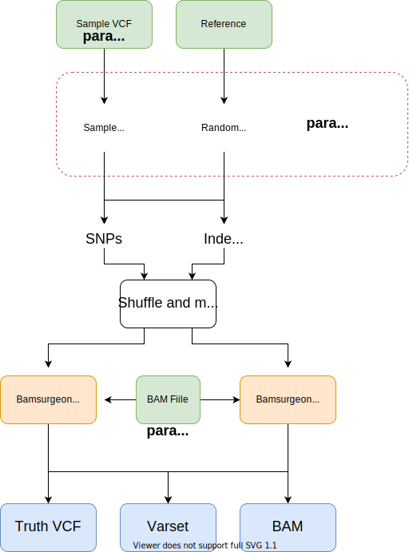

# variant-simulations-nf

## Overview

This nextflow pipeline generates a set of bams using bamsurgeon from which variant evaluation can take place.

The following steps are performed.

* __real__ variants are samples from a given VCF (`params.vcf_file`) and spiked into a test bam (`params.bam_file`) (Both SNP and INDEL).
* __simulated__ simulated variants are generated from a FASTA (Both SNP and INDEL).
* __resample__ - To create joint variants, all variants are combined and shuffled from __real__ and __simulated__.
                 A random number is chosen from the top of the resampled set to replace
                 variants in the existing set.

## Configuration

The following options can be configured.

* `params.vcf_file` - a VCF file from which to sample real variants.
* `params.bam_file` - a BAM file to spike variants into.
* `params.n_variants` - The number of variants to spike in for each varset.

__Comparison Tools__

* [ ] https://github.com/Illumina/hap.py
* [ ] https://github.com/dancooke/starfish
* [ ] https://github.com/vcflib/vcflib
* [ ] https://github.com/vcftools/vcftools

## History

The original variant simulations were run here:

[Variant-caller-analysis](https://github.com/AndersenLab/variant-caller-analysis) ~ snakemake